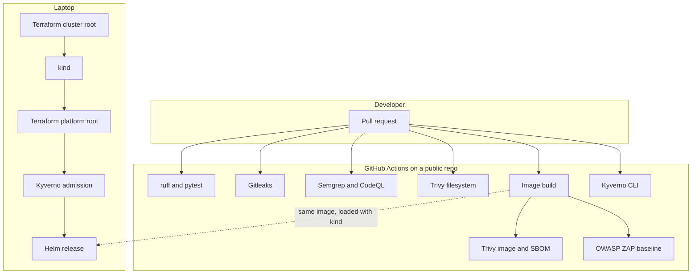

# devsecops-pipeline-showcase

[](https://github.com/Lawrence-Flash/devsecops-pipeline-showcase/actions/workflows/ci.yml)
[](https://github.com/Lawrence-Flash/devsecops-pipeline-showcase/actions/workflows/codeql.yml)

**Personal lab project by Lawrence Tshabalala.** This is not employment, not a client system, and not a production environment. It exists so a junior DevSecOps portfolio can show a pipeline that actually gates a deploy.

A small Python API does not reach Kubernetes unless secret scanning, SAST, dependency and image scanning, an SBOM, a DAST baseline, and policy-as-code all run on GitHub Actions. The cluster itself is [kind](https://kind.sigs.k8s.io/) on a laptop, built with Terraform. Nothing here needs a paid cloud account or a repository secret.

## What is in the box

The workload is a FastAPI "tickets" service with API-key auth, Pydantic validation, SQLite, a `slowapi` rate limit, and security-headers middleware. Pytest covers auth, validation, and a SQL-injection-shaped payload that is stored as data.

The image is a multi-stage build. The runtime user is uid 10001, capabilities are dropped, and the root filesystem is read-only. SQLite uses `/tmp`, which Kubernetes mounts as an emptyDir.

| Path | What it is |
| --- | --- |
| `app/` | The API and pytest suite |
| `Dockerfile` | Non-root, digest-pinned, multi-stage image |
| `charts/tickets-api/` | Helm chart: Deployment, Service, ServiceAccount, NetworkPolicy, quota, limit range |
| `policies/kyverno/` | Privileged, non-root, read-only root, limits, no `:latest` |
| `policies/testdata/` | Pods that must be rejected. Trivy skips this directory on purpose |
| `infra/terraform/cluster/` | kind cluster, then `kind load` of the local image |
| `infra/terraform/platform/` | Kyverno Helm release, kubectl apply of the policies, app Helm release |
| `.github/workflows/` | The gates below |
| `.github/dependabot.yml` | Weekly update PRs for pip, Docker, Actions, and Terraform |

## Architecture



CI does not create the kind cluster. ZAP scans the same image running as a container, with a read-only root and all capabilities dropped. Terraform is validated in CI and applied locally. That split keeps the free runners reliable: a kind cluster inside every pull request is slow and flaky, and it is not required to prove the chart or the image.

## Controls

High and critical findings fail the job. Semgrep fails on error-level findings, which is where the custom rules sit. ZAP's baseline action is set to fail on alerts, so warnings fail that job too until they are fixed or written up in `.zap/rules.tsv`.

| Control | Tool | When it runs | What fails the job | Threat it is there for |
| --- | --- | --- | --- | --- |
| Tests and lint | pytest, ruff | Every pull request and push to `main` | A failing test or a lint error | Regressions in auth and validation |
| Secret scanning | Gitleaks 8.30.1 | Same, full git history | Any leak it recognises | Credentials committed to git (CWE-798) |
| SAST | Semgrep CE, plus `.semgrep/custom-rules.yml` | Same | Error-level findings | SQL built with f-strings, `shell=True`, and the Python / Dockerfile / Kubernetes packs |
| SAST | CodeQL (`security-extended`) | Same | `security-severity` ≥ 7.0, or SARIF level `error` | Source-level bugs. Results also upload to the Security tab |
| SCA, IaC, secrets | Trivy filesystem | Same | HIGH or CRITICAL | Vulnerable Python packages, Dockerfile and Kubernetes and Terraform misconfigurations, secrets on disk |
| Image scan | Trivy image | Same, after `docker build` | HIGH or CRITICAL | Vulnerabilities and secrets baked into the image |
| SBOM | Trivy CycloneDX | Same | The job fails if the file is missing | Knowing which components shipped, after something like Log4Shell |
| Policy-as-code | Kyverno CLI 1.19.1 | Same, against `helm template` output | The chart violates a policy, or a negative test is accidentally allowed | Privileged containers, root, writable rootfs, missing limits, `:latest` |
| DAST | OWASP ZAP baseline | Same, against the running container | Alerts that are not tuned in `.zap/rules.tsv` | Missing headers and other issues that only show up on a live response |
| Dependency updates | Dependabot | Weekly PRs | Does not fail CI. It opens PRs | Stale dependencies. Alerts and security updates are a repo setting |
| Admission | Kyverno in the cluster | `terraform apply` on the laptop | Pod creation is rejected | The same policies, at deploy time rather than only in CI |
| Pod Security | Namespace label `restricted` | Same | The kubelet rejects a non-restricted pod | A second, built-in control beside Kyverno |
| Network | NetworkPolicy | While the pod is running | Traffic the policy does not allow | The process accepting anything other than TCP 8000, or calling out |
| Workload identity | Dedicated ServiceAccount, token not mounted, no Role | While the pod is running | There is nothing to fail in CI | A compromised process using the Kubernetes API |

Two notes so this table stays honest:

- Kyverno 1.19 prints a deprecation warning because `ClusterPolicy` is being replaced by `ValidatingPolicy`. These policies still enforce. `ClusterPolicy` is what the CLI autogen feature expands onto Deployments, StatefulSets, DaemonSets, Jobs, and CronJobs, which is how `helm template` output gets checked. System namespaces (`kube-system`, `kyverno`, `kube-public`, `kube-node-lease`) are excluded so Kyverno can run its own controllers.
- The custom Semgrep rules are starter rules so the gate is real on day one. Add another rule yourself before an interview. You should be able to explain a rule you wrote.

### Short threat model

| STRIDE | What this lab actually does about it |
| --- | --- |
| Spoofing | Ticket routes require an `X-API-Key` header, compared with `secrets.compare_digest`. The lab key is injected at deploy time. It is not a production secret. |
| Tampering | The image is digest-pinned. The root filesystem is read-only. CI rejects `:latest`. |
| Repudiation | Not in this MVP. There is no audit log beyond container stdout. |
| Information disclosure | Gitleaks, Trivy secret scanning, and CodeQL look for committed secrets. Docs and OpenAPI are off unless `ENABLE_OPENAPI=true`. Error responses do not echo the supplied key. |
| Denial of service | `slowapi` limits the ticket routes. The chart sets CPU and memory requests and limits, plus a quota and a limit range. |
| Elevation of privilege | Non-root uid 10001, `allowPrivilegeEscalation: false`, all capabilities dropped, seccomp `RuntimeDefault`, Pod Security `restricted`, no service-account token, no Role. |

## How to run it locally

You need Python 3.12 for the tests. Docker is enough to run the image. The cluster also needs kind, kubectl, Terraform 1.6 or newer, and Helm 3 if you want `make policy` (the Terraform Helm provider does not need the Helm CLI).

### Tests

```bash
python3 -m venv .venv
source .venv/bin/activate
pip install -r requirements-dev.txt
export TICKETS_API_KEY=lab-demo-key
make test
make lint
```

Optional, if you install [pre-commit](https://pre-commit.com/): `pre-commit install` runs ruff and Gitleaks on commit.

### Docker

```bash
docker build -t tickets-api:local .
docker run --rm --read-only --tmpfs /tmp \
  --cap-drop ALL --security-opt no-new-privileges \
  -p 8000:8000 -e TICKETS_API_KEY=lab-demo-key \
  tickets-api:local
```

In another terminal:

```bash
curl -sS http://127.0.0.1:8000/health
curl -sS -H "X-API-Key: lab-demo-key" -H "Content-Type: application/json" \
  -d '{"title":"lab","body":"hello"}' \
  http://127.0.0.1:8000/tickets
```

`lab-demo-key` is a placeholder so the container has something to compare against. Do not reuse the pattern for a real key, and do not commit a real one. The image refuses to start if `TICKETS_API_KEY` is missing or shorter than 8 characters.

### Policy check without a cluster

```bash
make policy
```

That renders the chart and runs `kyverno apply`. It also expects the privileged pod and the `:latest` pod under `policies/testdata/` to be rejected. If those pods start passing, the gate is broken and the script exits 1.

### kind and Terraform

Build the image first. `make up` does that, then applies the two roots in order.

```bash
make up
curl -sS http://127.0.0.1:30080/health
make down
```

Why two roots: the Helm and Kubernetes providers need a kubeconfig, and Terraform configures providers before it creates resources. The cluster root writes `infra/terraform/cluster/.kubeconfig` (gitignored). The platform root reads that file, installs the Kyverno chart, applies `policies/kyverno/`, and installs this chart into a namespace labelled for Pod Security `restricted`. On kind the Service is a NodePort on 30080. The chart default, which CI renders, is a ClusterIP.

The platform root is the piece you would keep if a future cloud module replaced the kind root and wrote a kubeconfig to the same path. That swap has not been run. There is no AKS, EKS, or GKE in this project.

`kubectl port-forward` is not filtered by NetworkPolicy. The NodePort is. Egress from the pod is denied because the API does not call anything else.

## What a blocked pull request looks like

A second branch, `cursor/demo-blocked-secret-086e`, adds one file on purpose: a fake AWS key in the public documentation format, marked DEMO and not a live credential. That pull request is not meant to be merged.

On a clean branch the checks in the table above are green. On the demo branch the secret scanners go red. Gitleaks reports the key in git history. Trivy filesystem secret scanning reports it as well. CodeQL or Semgrep may also flag the hard-coded credential. The rest of the demo diff is not the point. The failing check is the finding, and the pull request stays open so the red jobs can be screenshotted.

What you should see on that pull request:

1. Open the pull request. The title says DEMO and DO NOT MERGE.
2. The `gitleaks` job fails. The log names the file and redacts the value.
3. The `trivy-filesystem` job fails on the same secret.
4. `lint-and-test`, `kyverno`, and `terraform` can still pass, which shows the failure is the secret and not a broken pipeline.

Screenshot those red checks into this section when you have them. Do not paste the key into the README. Gitleaks will fail `main` if you do.

Push protection and "required status checks" are not on until you enable them. A red job blocks a merge only after branch protection says the check is required. Until then, GitHub will still show the failure, and someone with write access could merge anyway.

## What this MVP does not do

- No paid cloud, and no claim of having run this on AKS, EKS, or GKE.
- No image push to GHCR. That is free for public packages and is a sensible next step. It needs `packages: write`, so it is left out until the gates are green.
- No Prometheus or Grafana, no kube-bench report, no cosign, no GitLab CI port. Those were phase 2 in the plan.
- ZAP is an unauthenticated baseline against `/`. It is not an authenticated assessment of the ticket routes. Those routes are covered by pytest.
- `slowapi` is the rate limiter. Its response-header injection is off because slowapi 0.1.10 crashes on current FastAPI when the endpoint returns a model. The limit itself still returns 429.

## What you still have to turn on

The workflows cannot flip repository settings.

1. Branch protection on `main`, requiring `lint-and-test`, `gitleaks`, `semgrep`, `trivy-filesystem`, `trivy-image`, `kyverno`, `terraform`, `zap-baseline`, and `codeql`.
2. Settings → Code security → Dependabot alerts, and Dependabot security updates. `dependabot.yml` only opens version-update PRs.
3. Secret scanning and push protection, which are free on public repositories.
4. Leave CodeQL default setup off while `.github/workflows/codeql.yml` is here, or you will get two analyses.
5. Install Docker, kind, kubectl, Terraform, and Helm, then run `make up` and keep a screenshot.
6. Screenshot the demo pull request. Do not merge it.
7. Write one more Semgrep rule in your own words so you can talk through it.

A false positive, when you meet one, belongs in `.trivyignore` or `.zap/rules.tsv` with a reason and an expiry. Do not silence a high finding to make the badge green.
